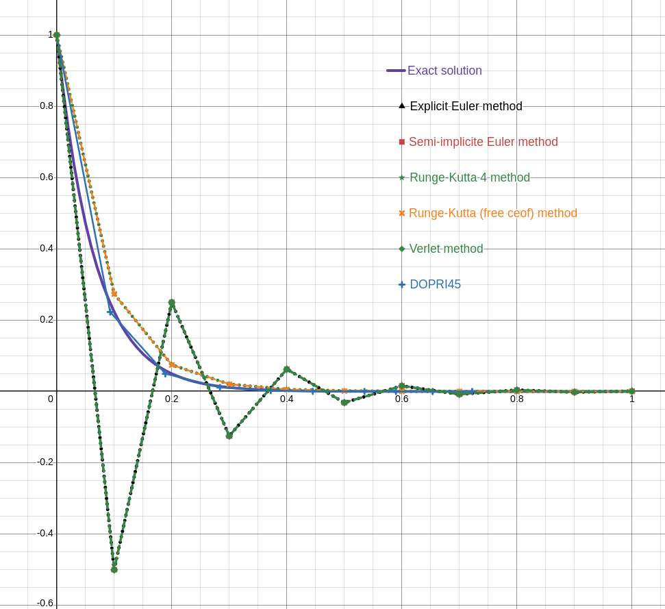

# ODEsolverlib

Short and simple static/shared library to solve Ordinary Differential Equation

## Ready to start

```console
$ make dyn
$ make static
$ ./main
```

The main.c program is just an exemple of use and it find values of a simple stiff equation with different method such as:
- Euler methods (Explicit and semi-implicit)
- Verlet methods
- Runge-kutta methods 
- Dormand-Prince methods


## The results of this program:

[](/picture)


The stiff equation is an excellent bench mark for ODE solver and I use the same as the [Wikipedia page](https://en.wikipedia.org/wiki/Stiff_equation).
